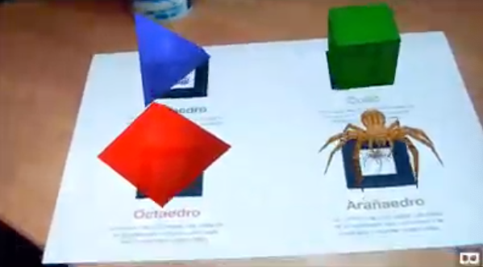
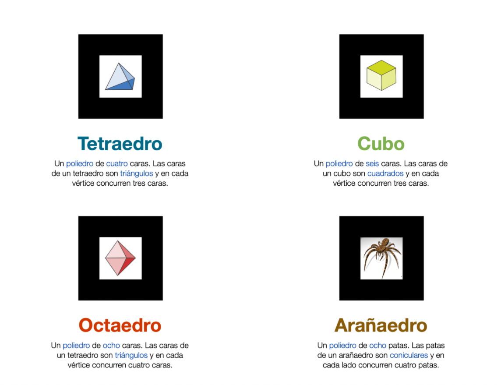

# AR.js-test

Proyecto para probar AR.js

Se utilizan cuatro marcas personalizadas para mostrar tres polígonos diferentes y un objeto 3D generados y animados con [A-Frame](https://aframe.io).

## Utilización

1. Descargar la [hoja de marcas](https://github.com/alfonsogchico/AR.js-test/blob/master/hoja%20de%20marcas.pdf) o usar directamente la imagen de más abajo.
2. Visitar la [web del proyecto](https://alfonsogchico.github.io/AR.js-test/) con un dispositivo móvil, permitir el acceso a la cámara y apuntar a la hoja de marcas.

## Hoja de marcas

